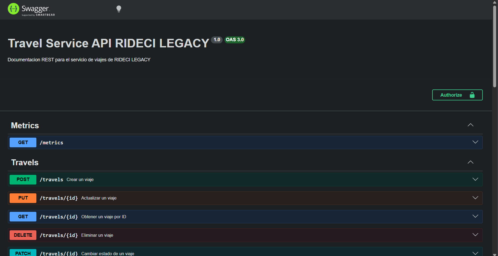
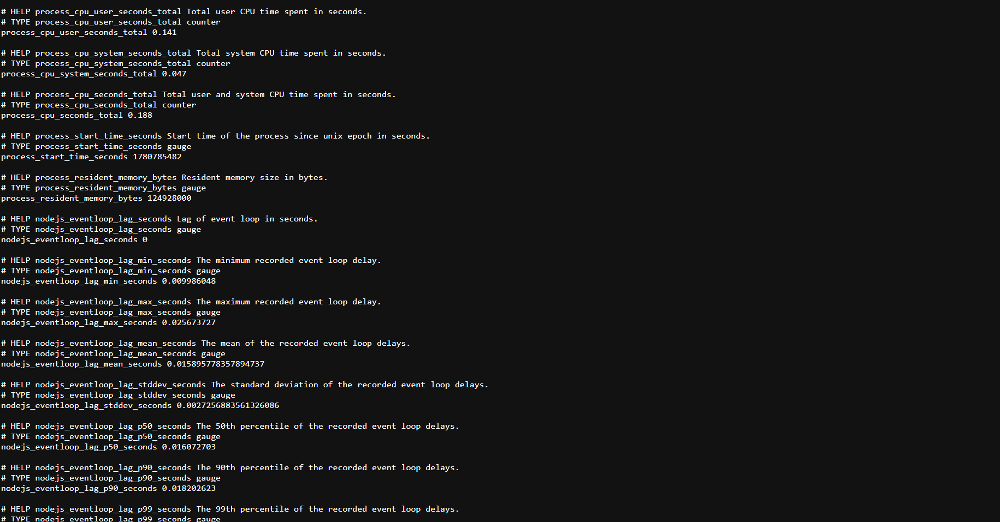

# Galaga Travel Service

Microservicio REST para la gestión de viajes compartidos, parte de la plataforma **RIDECI LEGACY**. Construido con **NestJS**, **MongoDB** (via Prisma ORM) y **RabbitMQ** para comunicación asíncrona entre servicios.

---

## Tecnologías principales

| Tecnología | Uso |
|---|---|
| NestJS 11 | Framework principal |
| MongoDB + Prisma 6 | Base de datos y ORM |
| RabbitMQ (amqplib) | Mensajería de eventos |
| Swagger / OpenAPI | Documentación de la API |
| Prometheus (prom-client) | Métricas del servicio |
| class-validator | Validación de DTOs |

---

## Arquitectura

El servicio implementa **arquitectura hexagonal (Ports & Adapters)**:

```
src/
├── travels/
│   ├── domain/              # Entidades y enums del negocio
│   ├── application/
│   │   ├── service/         # Lógica de negocio
│   │   ├── ports/out/       # Interfaces (repositorio + publicador de eventos)
│   │   └── events/          # Definición de eventos de dominio
│   └── infraestructure/
│       ├── controller/      # HTTP Controllers + DTOs
│       ├── persistence/     # Adaptador Prisma/MongoDB
│       └── rabbit/          # Adaptador RabbitMQ
└── metrics/                 # Métricas Prometheus
```

---

## Variables de entorno

Crea un archivo `.env` en la raíz del proyecto basándote en `.env.example`:

```env
DATABASE_URL=mongodb+srv://<usuario>:<password>@<cluster>.mongodb.net/<database>
RABBITMQ_URL=amqp://localhost
PORT=3000
```

> Si RabbitMQ no está disponible, el servicio arranca igualmente pero omite la publicación de eventos.

---

## Pasos para instalación

### Prerequisitos

- Node.js 18 o superior
- pnpm
- Instancia de MongoDB (local o cloud, ej. MongoDB Atlas)
- Instancia de RabbitMQ (local o cloud) — opcional

### 1. Clonar el repositorio

```bash
git clone <url-del-repositorio>
cd galaga-travel-service
```

### 2. Instalar dependencias

```bash
pnpm install
```

### 3. Configurar variables de entorno

```bash
cp .env.example .env
# Editar .env con tus credenciales de MongoDB y RabbitMQ
```

### 4. Generar el cliente de Prisma

```bash
pnpm exec prisma generate
```

### 5. Ejecutar el servicio

```bash
# Desarrollo con hot-reload
pnpm run start:dev

# Producción
pnpm run build
pnpm run start:prod
```

### 6. Verificar que levantó correctamente

- API: [http://localhost:3000](http://localhost:3000)
- Swagger UI: [http://localhost:3000/docs](http://localhost:3000/docs)
- Métricas: [http://localhost:3000/metrics](http://localhost:3000/metrics)

---

## Endpoints

**Base URL:** `/travels`

| Método | Endpoint | Descripción | Body | Response | Evento RabbitMQ |
|---|---|---|---|---|---|
| `POST` | `/travels` | Crea un nuevo viaje | `CreateTravelDto` | `201` | `travel.created` |
| `GET` | `/travels/all` | Lista todos los viajes | — | `200` — array de viajes | — |
| `GET` | `/travels/:id` | Obtiene un viaje por su ID | — | `200` / `404` | — |
| `GET` | `/travels/driver/:driverId` | Lista los viajes de un conductor | — | `200` — array de viajes | — |
| `GET` | `/travels/organizer/:organizerId` | Lista los viajes de un organizador | — | `200` — array de viajes | — |
| `GET` | `/travels/passenger/:passengerId` | Lista los viajes de un pasajero | — | `200` — array de viajes | — |
| `GET` | `/travels/occupantList/:id` | Retorna la lista de pasajeros de un viaje | — | `200` — array de IDs | — |
| `PUT` | `/travels/:id` | Actualiza todos los datos de un viaje | `CreateTravelDto` | `200` — viaje actualizado | `travel.updated` |
| `PATCH` | `/travels/:id` | Cambia el estado del viaje | `{ status }` | `200` — viaje actualizado | `travel.completed` (si aplica) |
| `PATCH` | `/travels/:id/slots` | Actualiza los cupos disponibles | `{ availableSlots }` | `200` | — |
| `PATCH` | `/travels/:id/passengers` | Actualiza la lista de pasajeros | `{ passengersId }` | `200` | `travel.passengers.updated` |
| `DELETE` | `/travels/:id` | Elimina un viaje por ID | — | `204 No Content` | `travel.cancelled` |
| `GET` | `/metrics` | Métricas Prometheus del servicio | — | `200` — texto Prometheus | — |

---

## Modelos

### CreateTravelDto

```json
{
  "organizerId": 1,
  "driverId": 2,
  "availableSlots": 3,
  "status": "CREATED",
  "travelType": "DAILY",
  "vehicleType": "CAR",
  "estimatedCost": 5000,
  "departureDateAndTime": "2025-06-10T08:00:00.000Z",
  "passengersId": [10, 11],
  "conditions": "No mascotas",
  "origin": {
    "latitude": 6.2442,
    "longitude": -75.5812,
    "direction": "Calle 50 # 40-20, Medellín"
  },
  "destination": {
    "latitude": 6.2530,
    "longitude": -75.5749,
    "direction": "Carrera 70 # 45-10, Medellín"
  },
  "durationMinutes": 25
}
```

### Enums

| Campo | Valores permitidos |
|---|---|
| `status` | `CREATED` \| `IN_PROGRESS` \| `COMPLETED` \| `CANCELLED` |
| `travelType` | `DAILY` \| `OCCASIONAL` |
| `vehicleType` | `CAR` \| `MOTORCYCLE` \| `BUS` \| `BICYCLE` |

---

## Eventos publicados en RabbitMQ

**Exchange:** `travel.exchange` (tipo: topic)

| Evento | Routing Key | Cuándo se publica |
|---|---|---|
| TravelCreatedEvent | `travel.created` | Al crear un viaje |
| TravelUpdatedEvent | `travel.updated` | Al actualizar un viaje |
| TravelCompletedEvent | `travel.completed` | Al cambiar estado a `COMPLETED` |
| TravelCancelledEvent | `travel.cancelled` | Al eliminar un viaje |
| TravelUpdatedEvent | `travel.passengers.updated` | Al actualizar pasajeros |

---

## Evidencia Swagger 


---

## Evidencia Métricas Corriendo


---
